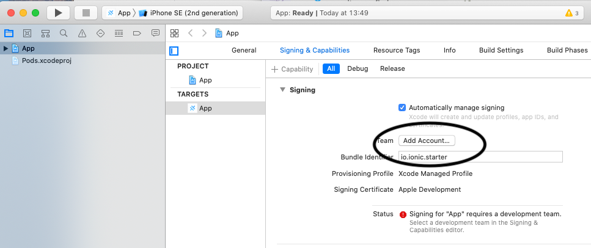

# mobile-playground


This repository contains a playground / showcase application making use of:

- swarming library
- DXOS SDK

## First steps

Install dependencies:

```bash
yarn
yarn build
```

Run the React application in the browser:

```bash
yarn start
```

## iOS development

### Prerequisites

1. Install Xcode
2. Install [cocoapods](https://cocoapods.org/)

### Running the app

1. Start the iOS project:

```bash
yarn start:ios
```

2. Update project's Signing & Capabilities

In XCode:

First, go to project's Signing & Capabilities, and add a team.



Then, select the team, and change Bundle Indentifier to a custom string.

Expected:


3. Start the app in an emulator by clicking on the play button

4. To run on a physical device, unlock the device first [enable developer mode](https://www.wikihow.com/Enable-Developer-Mode-on-an-iPhone)

## Android development

### Prerequisites

1. Install Android Studio
2. Add platfrom tools to your path:

```bash
# macOS specific
export PATH="$PATH:$HOME/Library/Android/sdk/platform-tools"
```

2. Accept the [agreements](https://stackoverflow.com/questions/39760172/you-have-not-accepted-the-license-agreements-of-the-following-sdk-components)

NOTE: This may require java version 8, despite the fact that Android Studio ships with OpenJDK!

### Running the app

1. Init android project:

```bash
yarn init:android
```

2. Start the Android Studio project:

```bash
yarn start:android
```

2. Hit the play button to start the app in emulator