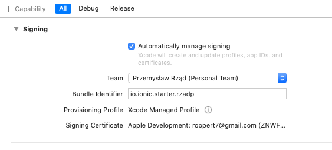

# mobile-playground


This repository contains a playground / showcase application making use of:

- swarming library
- DXOS SDK

## First steps

Install dependencies:

```bash
yarn
yarn build
```

Install Ionic framework globally:

```bash
npm install -g @ionic/cli
```

## Development in browser

The React app can be developed without running Xcode or Android Studio first.

To run the application in the browser:

```bash
yarn start
```

## iOS development

The following sections describe preparing and running the app in Xcode.

### Installing Xcode

1. Install Xcode
2. Install [cocoapods](https://cocoapods.org/)

### Configuring Xcode

1. Start the iOS project:

```bash
yarn start:ios
```

2. Update project's Signing & Capabilities

In XCode:

First, go to project's Signing & Capabilities, and add a team.


Then, select the team, and change Bundle Indentifier to a custom string, e.g. `io.ionic.starter.<YOUR NAME>`

Expected:



If you're seeing the following error:


Then `TODO, WHAT THEN?`

### Running the iOS app

Start the app in an emulator by clicking on the play button

To run on a physical device, unlock the device first [enable developer mode](https://www.wikihow.com/Enable-Developer-Mode-on-an-iPhone)

## Android development

The following sections describe preparing and running the app in Android Studio.

### Preparing Android Studio

1. Install [Android Studio](https://developer.android.com/studio)

Continue with "OK" in case of the following screen:


1. Init the Android project:

```bash
yarn init:android
```

2. Start the Android Studio project:

```bash
yarn start:android
```

The command should result in Android Studio automatically opening with the Ionic project open.

If you're seeing missing android-N errors:


Then go to `tools => SDK Manager` and install the corresponding API level record:


Hit apply to trigger installation. Afterward close Android Studio, and run `yarn start:android` again.

3. Adding emulator device

Android Studio needs an emulator device to run the app (unless running on physical device).

Go to `tools => AVD Manager`, and add a new device.

Select a System Image with corresponding API level:


Hit `Download` if the image is not yet downloaded.

After adding the device, hit the play icon in the newly created device's Actions section, to make sure it runs properly:


### Running the Android app

To run the Android app, git the green 'play' button with a device selected:


